<p align="center">
    
</p>
<h1 align="center">落API</h1>
<p align="center"><strong>落API是一个为用户和开发者提供高速稳定免费APi接口调用的平台</strong></p>
<div align="center">
<a target="_blank" href="https://github.com/1ranxu/luoapi-backend">
    
</a>
<a target="_blank" href="https://github.com/1ranxu/luoapi-backend">
    
</a>
    
<a target="_blank" href="https://www.oracle.com/technetwork/java/javase/downloads/index.html">
        
</a>
    
<a href="https://github.com/1ranxu/luoapi-backend" target="_blank">
    
</a>
<a href="https://github.com/1ranxu/luoapi-backend" target="_blank">
</a>
</div>


**[接口空间 - 落API (luoapi.icu)](http://luoapi.icu/)**


## 📋项目介绍 

**🙋作为用户您可以注册并登录账户，获取接口调用凭证，并根据自己的需求浏览和选择适合的接口。您可以在线进行接口调试，快速验证接口的功能和效果。**

**💻作为开发者，我们为您提供了[客户端SDK](https://github.com/1ranxu/luoapi-client-sdk)， 使用[开发者凭证](http://luoapi.icu/account/center)即可将轻松集成接口到您的项目中，实现更高效的开发和调用。** 

**🤝您可以在[客户端SDK](https://github.com/1ranxu/luoapi-client-sdk)提出issues，我们会帮助您将您开发的接口接入到落API接口开放平台，并发布给其他用户使用。**


## 🧭仓库导航


| 目录                                                     | 描述               |
|--------------------------------------------------------| ------------------ |
| [**luoapi-frontend**](https://github.com/1ranxu/luoapi-frontend) | 前端 |
| [**luoapi-backend**](https://github.com/1ranxu/luoapi-backend) | 后端 |
| **[luoapi-gateway](https://github.com/1ranxu/luoapi-gateway)** | 网关           |
| [**luoapi-interface**](https://github.com/1ranxu/luoapi-interface) | 接口           |
| **[luoapi-client-sdk](https://github.com/1ranxu/luoapi-client-sdk)** | SDK    |


## 🗺️主业务流程 


## 🚀快速启动 

### 前端

环境要求：Node.js >= 16

安装依赖：

```bash
yarn or  npm install
```

启动：

```bash
yarn run dev or npm run start:dev
```

部署：

```bash
yarn build or npm run build
```

### 后端

#### 环境准备

- **MySQL**

  执行 luoapi-backend 项目 sql 目录下 create_table.sql

- **Redis**

- **Nacos（2.2.0）**


#### 启动顺序

[**luoapi-backend**](https://github.com/1ranxu/luoapi-backend)

**[luoapi-gateway](https://github.com/1ranxu/luoapi-gateway)**

[**luoapi-interface**](https://github.com/1ranxu/luoapi-interface)


## 📚 技术栈 

### **后端**

- Spring Boot 2.7.0
- Spring MVC
- MySQL 数据库
- 腾讯云COS存储
- Dubbo 分布式（RPC、Nacos）
- Spring Cloud Gateway 微服务网关
- API 签名认证（Http 调用）
- Swagger + Knife4j 接口文档
- Spring Boot Starter（SDK 开发）
- Jakarta.Mail 邮箱通知、验证码
- Spring Session Redis 分布式登录
- Apache Commons Lang3 工具类
- MyBatis-Plus 及 MyBatis X 自动生成
- Hutool、Apache Common Utils、Gson 等工具库

### 前端

- React 18

- Ant Design Pro 5.x 脚手架

- Ant Design & Procomponents 组件库

- Umi 4 前端框架

- OpenAPI 前端代码生成

  

## ☁️功能介绍 

|                          **功能**                           | 游客 | **普通用户** | **管理员** |
| ----------------------------------------------------- |--------------|-----|-----|
| [**SDK使用**](https://github.com/1ranxu/luoapi-client-sdk) | ✅ | ✅ |     ✅      |
|                    切换主题、深色、暗色                     | ✅ | ✅ | ✅ |
|                        在线调试接口                         | ❌ | ✅ | ✅ |
|                       每日签到得积分                      | ❌ | ✅ | ✅ |
|                 接口大厅搜索接口、浏览接口                  | ✅ | ❌ | ✅ |
|                     邮箱验证码登录注册                      | ✅ | ✅ | ✅ |
|                          更新头像                           | ❌ | ✅ | ✅ |
|                    绑定、换绑、解绑邮箱                     | ❌ | ✅ | ✅ |
|                    用户管理、封号解封等                     | ❌ | ❌ | ✅ |
|                接口管理、接口发布、上线                 | ❌ | ❌ | ✅ |


## ✨功能展示 

### 接口空间

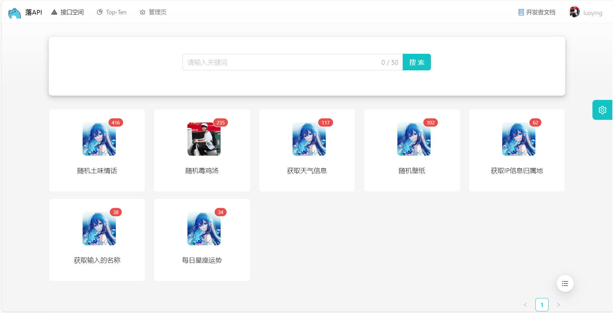


### 接口详情

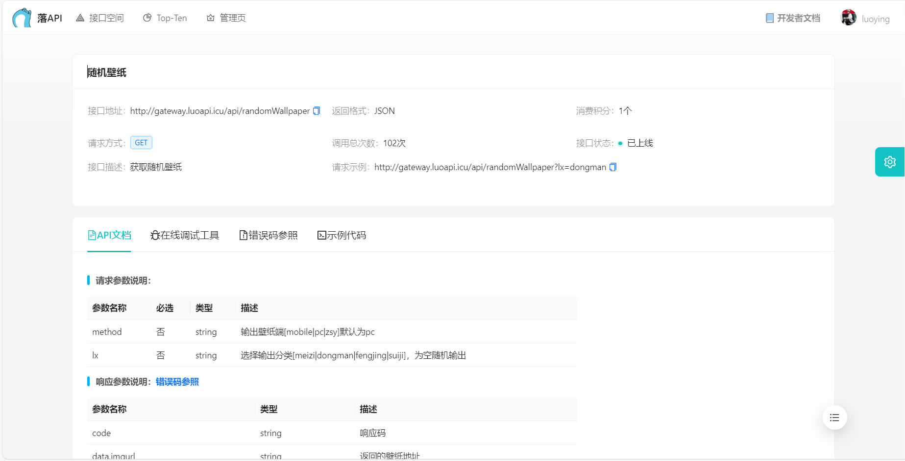


#### API文档

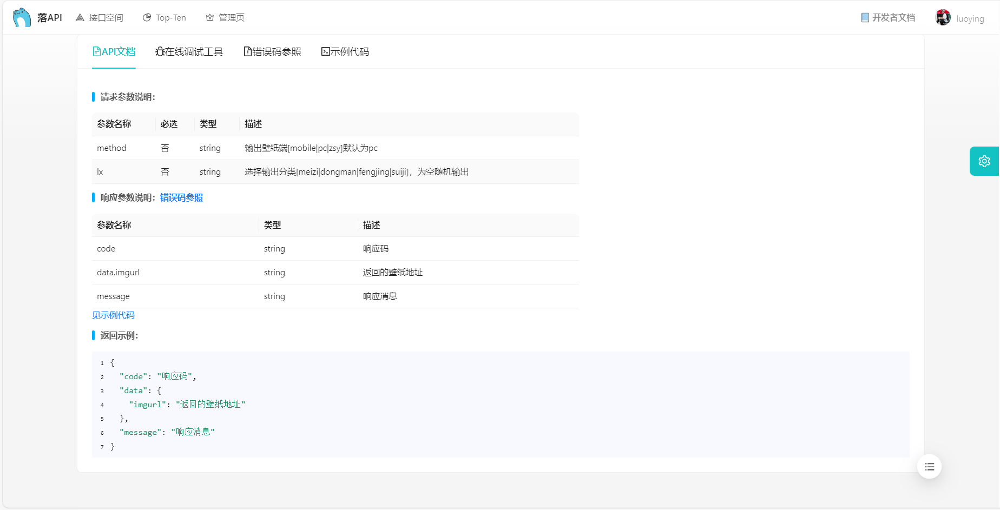


#### 在线调试工具

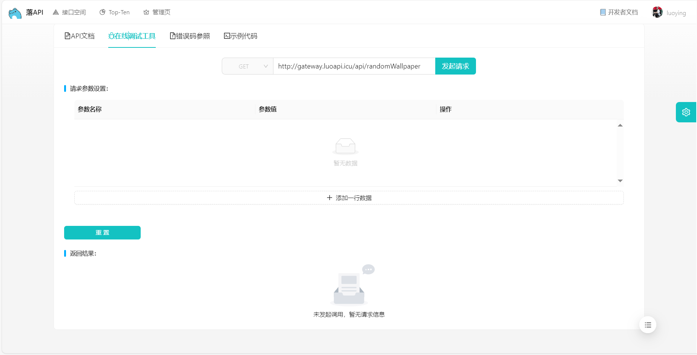


#### 错误码参考

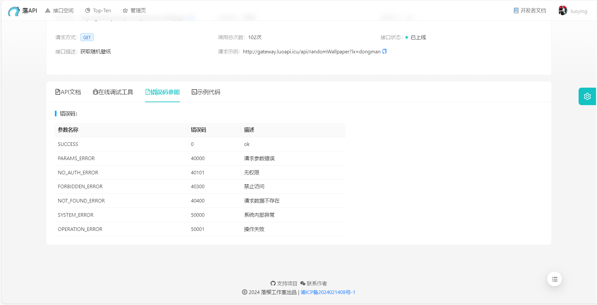


#### **接口调用示例代码**


### Top-Ten

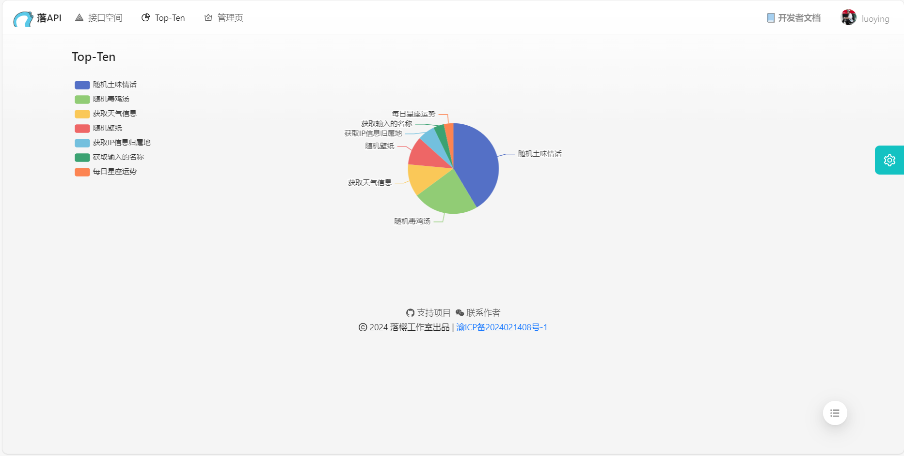


### 管理页

#### 接口管理

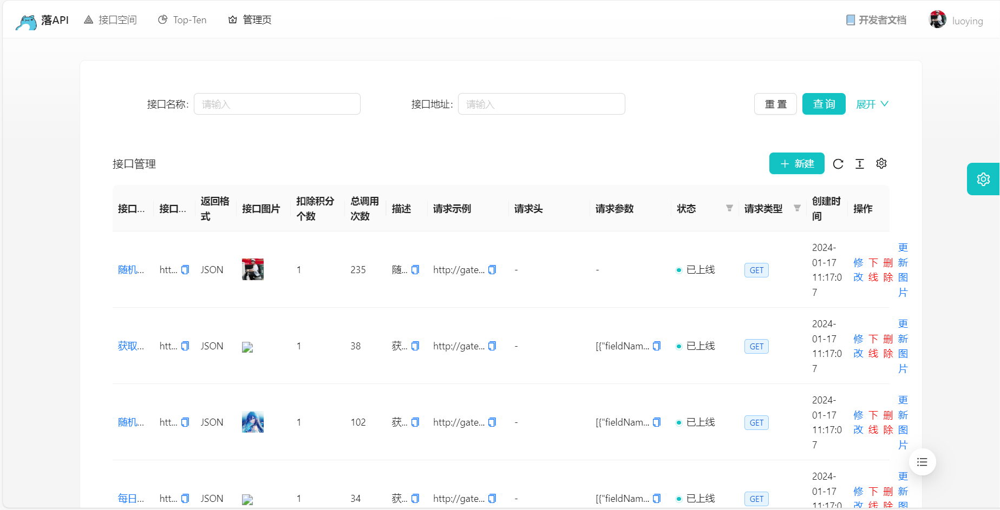


#### 用户管理

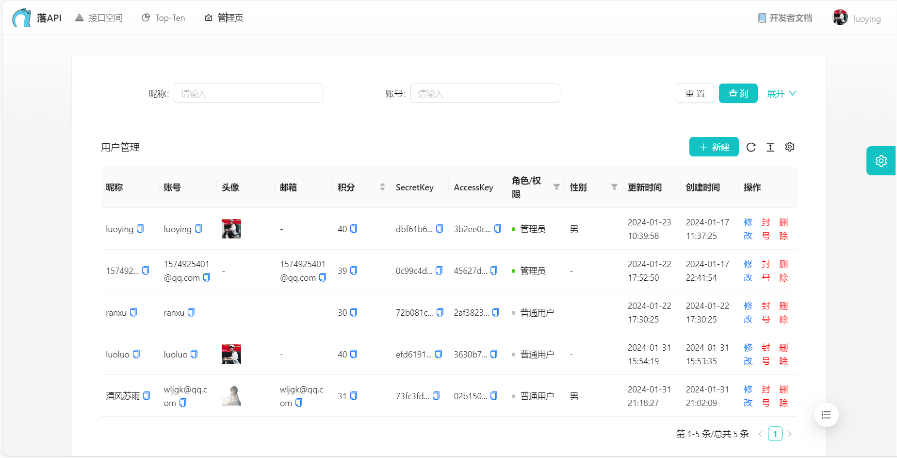


#### 动态更新请求响应参数

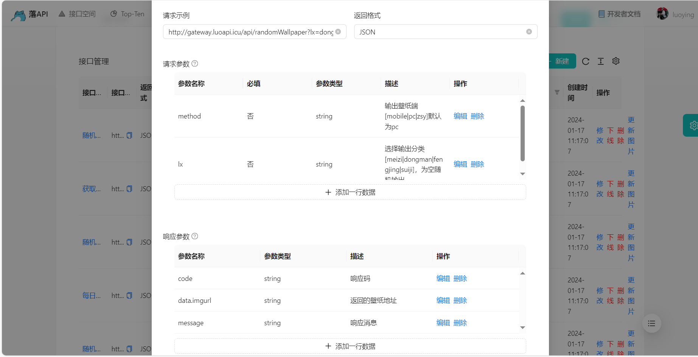


### 个人信息

#### 信息展示

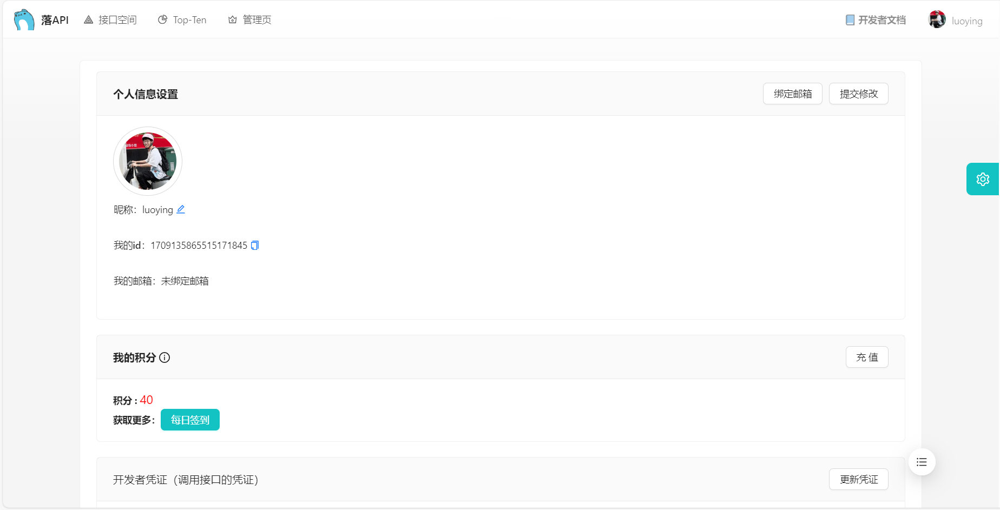


#### 每日签到

##### 签到成功


##### 签到失败

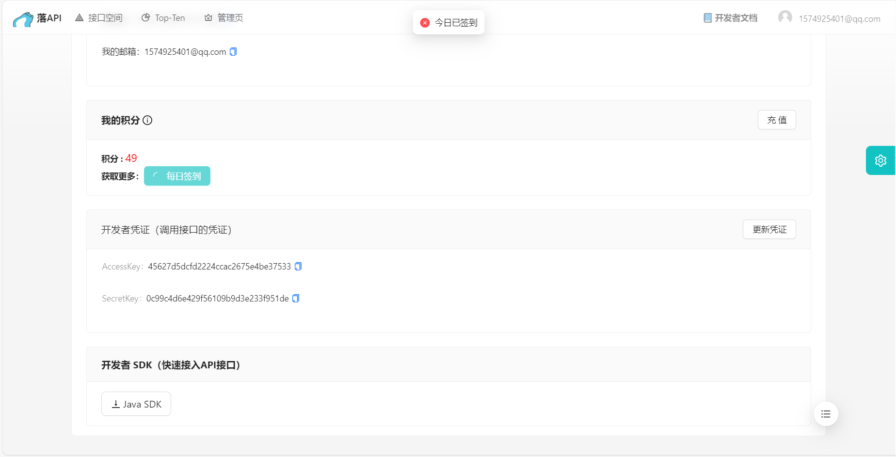


### 登录/注册


### 主题切换

#### 白色主题

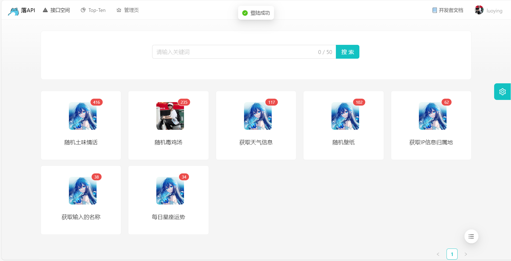


#### 深色主题

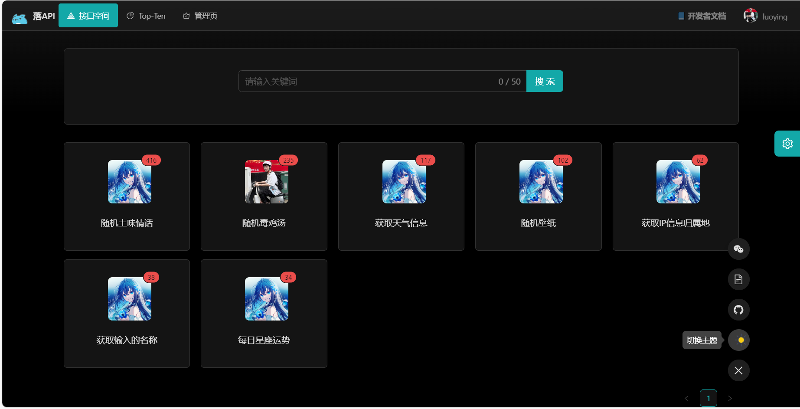
